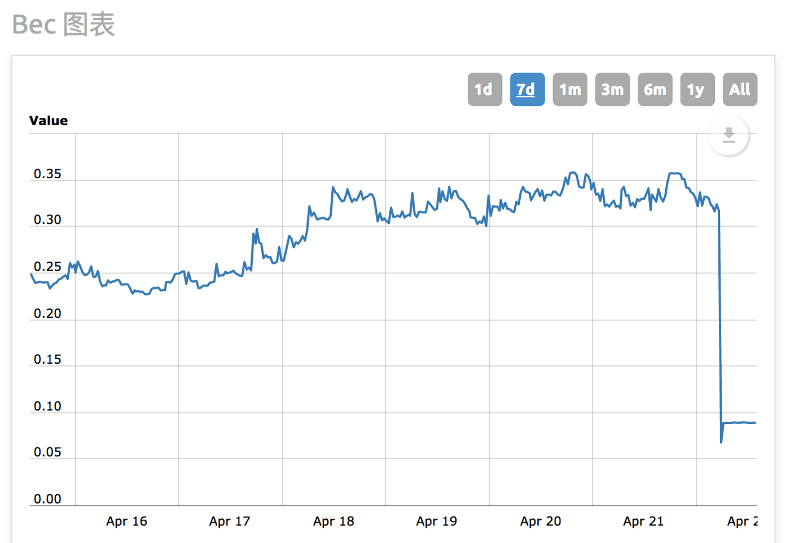

# solidity: Security

## security tools

### manticore by trail of bits

https://github.com/trailofbits/manticore
view demo

oyente mithril

### other tools

...

## Consensys smart contract best practice

https://consensys.github.io/smart-contract-best-practices/

## Integer Overflow and Underflow

### Description

An overflow/underflow happens when an arithmetic operation reaches the maximum or minimum size of a type. For instance if a number is stored in the uint8 type, it means that the number is stored in a 8 bits unsigned number ranging from 0 to 2^8-1. If a number is stored in the uint256 type, it means that the number is stored in a 256 bits unsigned number ranging from 0 to 2^256-1.

**Unsigned integer minimum/maximum values**:  
| Type | minimum | maximum |
|---|---:|:---|
|uint8 | 0| 256|
|uint16|0|65535|
|uint24|0|16777215|
|uint32|0|4294967295|
|uint40|0|1099511627775|
|uint48|0|281474976710655|
|uint56|0|72057594037927935|
|uint64|0|18446744073709551615|
|uint72|0|4722366482869645213695|
|uint80|0|1208925819614629174706175|
|uint88|0|309485009821345068724781055|
|uint96|0|79228162514264337593543950335|
|uint104|0|20282409603651670423947251286015|
|uint112|0|5192296858534827628530496329220095|
|uint120|0|1329227995784915872903807060280344575|
|uint128|0|340282366920938463463374607431768211455|
|uint136|0|87112285931760246646623899502532662132735|
|uint144|0|22300745198530623141535718272648361505980415|
|uint152|0|5708990770823839524233143877797980545530986495|
|uint160|0|1461501637330902918203684832716283019655932542975|
|uint168|0|374144419156711147060143317175368453031918731001855|
|uint176|0|95780971304118053647396689196894323976171195136475135|
|uint184|0|24519928653854221733733552434404946937899825954937634815|
|uint192|0|6277101735386680763835789423207666416102355444464034512895|
|uint200|0|1606938044258990275541962092341162602522202993782792835301375|
|uint208|0|411376139330301510538742295639337626245683966408394965837152255|
|uint216|0|105312291668557186697918027683670432318895095400549111254310977535|
|uint224|0|26959946667150639794667015087019630673637144422540572481103610249215|
|uint232|0|6901746346790563787434755862277025452451108972170386555162524223799295|
|uint240|0|1766847064778384329583297500742918515827483896875618958121606201292619775|
|uint248|0|452312848583266388373324160190187140051835877600158453279131187530910662655|
|uint256|0|115792089237316195423570985008687907853269984665640564039457584007913129639935|

**Signed integer minimum/maximum values**:  
| Type | minimum | maximum |
|---|:---|:---|
|int8 | 0| 256|
|int16|-32768|32767|
|int24|-8388608|8388607|
|int32|-2147483648|2147483647|
|int40|-549755813888|549755813887|
|int48|-140737488355328|140737488355327|
|int56|-36028797018963968|36028797018963967|
|int64|-9223372036854775808|9223372036854775807|
|int72|-2361183241434822606848|2361183241434822606847|
|int80|-604462909807314587353088|604462909807314587353087|
|int88|-154742504910672534362390528|154742504910672534362390527|
|int96|39614081257132168796771975168|39614081257132168796771975167|
|int104|-10141204801825835211973625643008|10141204801825835211973625643007|
|int112|-2596148429267413814265248164610048|2596148429267413814265248164610047|
|int120|-66461399789245793645190353014<br>0172288|6646139978924579364519035301<br>40172287|
|int128|-17014118346046923173168730<br>3715884105728|17014118346046923173168730371588<br>4105727|
|int136|-4355614296588012332331194<br>9751266331066368|435561429658801233233119497512663<br>31066367|
|int144|-11150372599265311570767859<br>136324180752990208|11150372599265311570767859136324<br>180752990207|
|int152|-285449538541191976211657<br>1938898990272765493248|28544953854119197621165719<br>38898990272765493247|
|int160|-73075081866545145910184241635<br>8141509827966271488|7307508186654514591018424163581415<br>09827966271487|
|int168|-18707220957835557353007165<br>8587684226515959365500928|18707220957835557353007165858<br>7684226515959365500927|
|int176|-47890485652059026823698344<br>598447161988085597568237568|4789048565205902682369834459844<br>7161988085597568237567|
|int184|-122599643269271108668667<br>76217202473468949912977468817408|122599643269271108668667762172024<br>73468949912977468817407|
|int192|-313855086769334038191789<br>4711603833208051177722232017256448|3138550867693340381917894711603<br>833208051177722232017256447|
|int200|-8034690221294951377709<br>81046170581301261101496891396417650688|80346902212949513777098104617<br>0581301261101496891396417650687|
|int208|-205688069665150755269371147819<br>668813122841983204197482918576128|205688069665150755269371147819668813122<br>841983204197482918576127|
|int216|-526561458342785933489590138418<br>35216159447547700274555627155488768|526561458342785933489590138418352161594<br>47547700274555627155488767|
|int224|-134799733335753198973335075435<br>09815336818572211270286240551805124608|13479973333575319897333507543509815336<br>818572211270286240551805124607|
|int232|-3450873173395281893717377931138<br>512726225554486085193277581262111899648|345087317339528189371737793113851272622<br>5554486085193277581262111899647|
|int240|-8834235323891921647916487503714592<br>57913741948437809479060803100646309888|883423532389192164791648750371459257913<br>741948437809479060803100646309887|
|int248|-22615642429163319418666208009509357002<br>5917938800079226639565593765455331328|226156424291633194186662080095093570025<br>917938800079226639565593765455331327|
|int256|-57896044618658097711785492504343953926<br>634992332820282019728792003956564819968|57896044618658097711785492504343953926<br>634992332820282019728792003956564819967|

In computer programming, an integer overflow occurs when an arithmetic operation attempts to create a numeric value that is outside of the range that can be represented with a given number of bits – either larger than the maximum or lower than the minimum representable value.  
**In Ethereum if maximum is reached, the value will circle back to its minimum value.**  
**In Ethereum if minimum is reached, the value will circle back to its maximum value.**

```solidity
// Overflow: nb1 equals 0
uint256 nb1 = 115792089237316195423570985008687907853269984665640564039457584007913129639935 + 1;
// Overflow: nb2 equals 1
uint256 nb2 = 115792089237316195423570985008687907853269984665640564039457584007913129639935 + 2;
// Underflow: nb3 equals 115792089237316195423570985008687907853269984665640564039457584007913129639927
uint256 nb3 = 1 - 10;
```

There are around 20 cases for overflow and underflow:

- overflow in unsigned->signed conversion
- overflow in signed->unsigned conversion
- overflow in size-decreasing implicit conversion
- overflow in addition of two signed numbers
- overflow in addition of two unsigned numbers
- underflow in subtraction of two signed numbers
- underflow in subtraction of two unsigned numbers
- overflow in multiplication of two signed numbers
- overflow in multiplication of two unsigned numbers
- overflow in shifts
- overflow in ++ on a signed number
- overflow in ++ on an unsigned number
- underflow in -- on a signed number
- underflow in -- on an unsigned number
- overflow in +=
- overflow in -=
- overflow in \*=
- overflow in /=
- exponentiation

This attack was use on the [BEC token](https://etherscan.io/address/0xc5d105e63711398af9bbff092d4b6769c82f793d#code) in April 22, 2018.
The line 261 of the smart contract was vulnerable to an integer overflow attack by multiplication in the `batchTransfer` function:

```solidity
function batchTransfer(address[] _receivers, uint256 _value) public whenNotPaused returns (bool) {
  uint256 cnt = _receivers.length;
  uint256 amount = uint256(cnt) * _value;
  require(cnt > 0 && cnt <= 20);
  require(_value > 0 && balances[msg.sender] >= amount);

  balances[msg.sender] = balances[msg.sender].sub(amount);
  for (uint256 i = 0; i < cnt; i++) {
    balances[_receivers[i]] = balances[_receivers[i]].add(_value);
    Transfer(msg.sender, _receivers[i], _value);
  }
  return true;
}

```

The vulnerable line of code is:

```solidity
uint256 amount = uint256(cnt) * _value;
```

The attack happened with `batchTransfer` function called with an array of 2 addresses as 1st argument for the `_receivers` parameter (addresses owned by attackers) and the value 578960446186580977117854925043439539266349923328202820197287 as 2nd argument for the `_value` parameter.  
The multiplication `578960446186580977117854925043439539266349923328202820197287 \* 2` set the `amount` variable to 0, and pass successfully the `require`:
`solidity require(_value > 0 && balances[msg.sender] >= amount);`

The tokens stolen would have been caused disasters, the price of BEC at that time was around $0.3 each. Fortunately, the hacker hadn’t sold much before the dev-team paused the contract. The market reacted by price-plunging.  


### Demonstration

### Defense

Use [SafeMath.sol](https://github.com/OpenZeppelin/openzeppelin-contracts/blob/master/contracts/math/SafeMath.sol) library from Openzepplin for arithmetic functions.

## tx.origin

## reentrency DAO flaw

https://blog.openzeppelin.com/reentrancy-after-istanbul/

### single function reentrancy attack

### cross-function reentrance attack

### Defense against reentrancy

#### checks-effects-interactions pattern

#### reentrancy guards

#### pull payments.

### Defense against

## DDOS
